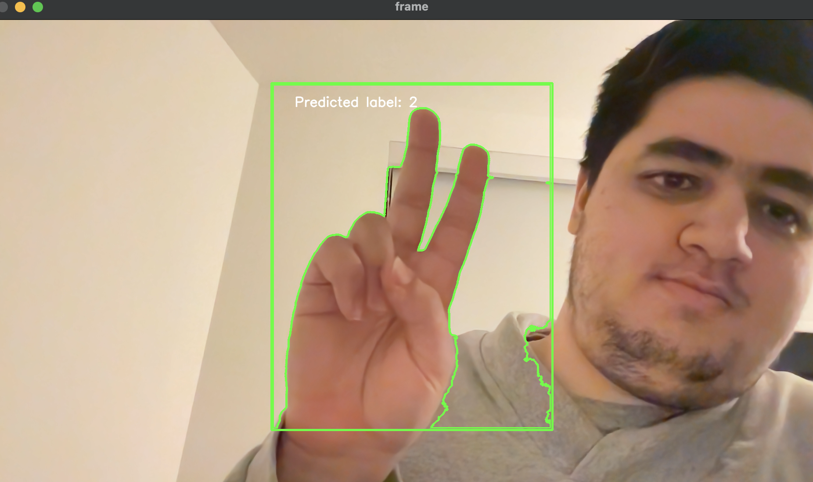

# 🖖 Hand Gesture Recognition Project

## 📚 Problem Definition

The problem is to recognize sign-language hand gestures from a video stream. This is useful because it can be used to create human computer interfaces that are more accessible to people with hearing disabilities. My analysis assumes that the background is relatively static and that the hand is the only moving object in the video stream.

Some difficulties that I anticipate are:

- The hand can be in different orientations and positions in the video stream.
- The hand can be in different lighting conditions.
- The hand can be occluded by other objects in the video stream.
- The hand can be in motion.

The gestures are defined as follows:

- **One**: The thumb is extended and the other fingers are closed.
- **Two**: The thumb and the index finger are extended and the other fingers are closed.
- **Three**: The thumb, index finger, and middle finger are extended and the other fingers are closed.
- **Four**: The thumb, index finger, middle finger, and ring finger are extended and the little finger is closed.
- **Five**: All fingers are extended.

## 🛠️ Method and Implementation

### Classical Computer Vision Algorithms

I use binary image analysis followed by max contour detection for the segmentation of the hand. I also use template matching (with templates augmented via different scales and rotations to capture possible scales and orientations of the hand) with the maximum normalized correlation coefficient for classifying the hand movement as the digit 1, 2, 3, 4, or 5. More detailed analysis of the algorithms and methodology check out this post on my personal website [here](https://alexlavaee.me/projects/hand-gesture-recognition).

## 🎮 Demo

### 📦 Setup

The project is implemented in Python 3.10. The dependencies are managed using Poetry. To install the dependencies, run the following commands:

```bash
# create a virtual environment
python -m venv .venv
# activate the virtual environment
source .venv/bin/activate
# install the dependencies
python -m pip install -e .
```

## 🚀 Usage

To run the live demo follow the instructions below. The demo will start the camera and display the live feed. The program will then wait for a few seconds (`start_delay_seconds`) to allow the camera to adjust to the lighting conditions and user to prepare the motion. **Note, that only content inside of the green bounding box will be processed, so that is where the user should put their hand.** After the delay, the program will start capturing frames (`num_frames_to_save`) and processing them. The program will display the processed frames and the classification results in real-time. The program will also save the binary image and processed frames to the specified directory (`save_dir`).

### Slight Technical Limitations

The program works best when the user tries to shape their hand to mimic the template images (`./templates/binary_images`) for the sign-language digit (1-5) that they are trying to automatically classify. The hand should be still and the background should be relatively static with not too much overexposure or underexposure in the camera. The program will not work well if the hand is in motion or if the background is not relatively static.

### Visualization of GUI

The program will display the following GUI:



#### Features of the GUI

- **Live Feed**: The live feed from the camera.
- **Classification Results**: The classification results (in white text) from the processed frames are displayed in real-time.
- **Hand Segmentation**: The hand segmentation (in green) from the processed frames are displayed in real-time in the green bounding box.
- **Binary Image**: The binary images from the live feed are saved to the specified directory (`save_dir`).

#### Interesting and Fun Aspects of the Graphics Display

- The classification results are displayed in "real-time."
- The hand segmentation and sign-language classification is displayed in real-time in the green bounding box.
- If a user has a Mac laptop, they can use Apple's [Continuity Camera](https://support.apple.com/en-us/102546) feature to use their iPhone as a live video feed source by specifying the `camera.id=1` or `camera.id=2` in the `conf/config.yaml` file or via a command line argument as shown in the [advanced usage section](#advanced-usage) of the README.

### Basic Usage

```bash
python main.py
```

### Advanced Usage

Refer to `predict` function in `main.py` for more details about parameters. You can specify the following parameters in the `conf/config.yaml` hydra configuration file or as command line arguments, e.g.

```bash
export TEMPLATE_MATCHING_TEMPLATES_BASE_DIR="./templates/front_face_camera/binary_hands"

python main.py \
hydra.job.name=demo \
camera.id=1 \
processing.template_matching.templates_base_dir=$TEMPLATE_MATCHING_TEMPLATES_BASE_DIR \
processing.template_matching.rotations="[-20.0,-10.0,0.0,10.0,20.0]" \
processing.template_matching.scales="[0.7,0.8,0.9,1.0]" \
processing.template_matching.labels_file="${TEMPLATE_MATCHING_TEMPLATES_BASE_DIR}/labels.csv" \
processing.template_matching.images_dir=$TEMPLATE_MATCHING_TEMPLATES_BASE_DIR
```

## 👥 Collaborators

* None